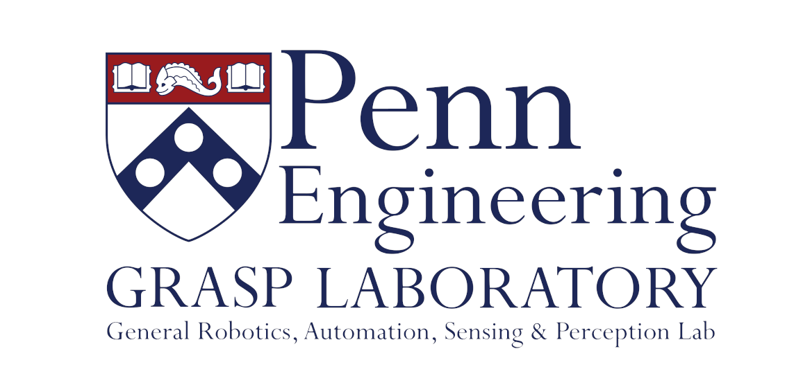
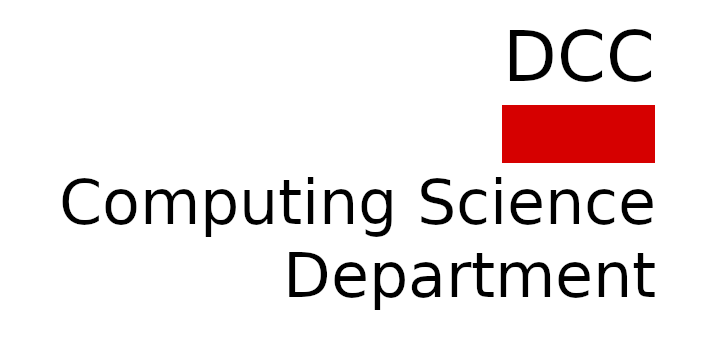
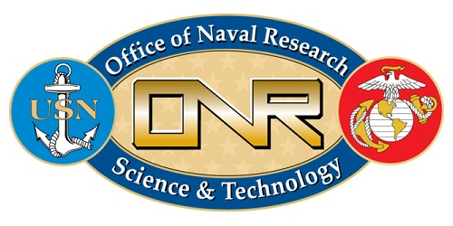
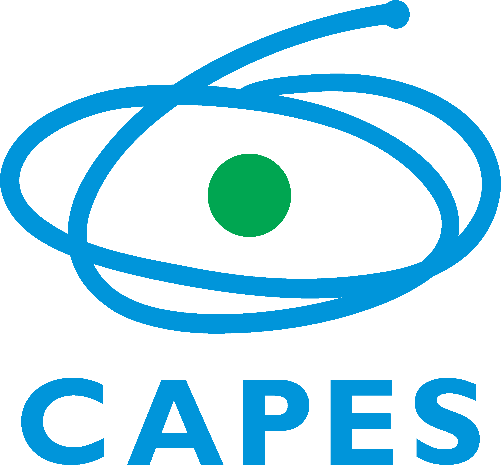
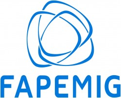

# [Table of Contents](#table-of-contents)

- [Setup](docs/working_environment.md)
- [Usage](docs/usage.md)
- [Robots](docs/robots.md)
- [Maps](docs/maps.md)
- [Nodes](docs/multi-robot-exploration.md)
- [Multi-robot Guidelines](docs/multi-robot-guidelines.md)
- [Contributing](docs/contributing.md)

## [ROS-Noetic-Multi-robot-Sandbox](#ros-noetic-multi-robot-sandbox)

This package has a fully opperational multi-robot exploration stack for ROS Noetic and Ubuntu 20.04 that allows them to keep intermittent communication in Gazebo 11 simulations. It contains an implementation and integration of the structures from this research: [https://arxiv.org/abs/2309.13494](https://arxiv.org/abs/2309.13494). With some minor modifications it can be deployed into real robots for indoor exploration.

It is a deployment of the diagram's components highlighted in red that allows robots to explore and maintain intermittent connectivity through a rendezvous plan, where the communication is done through topics with a mock communication model.

<p align="center">

</p>

## [What to Expect?](#what-to-expect)

### Fully opperational multi-robot exploration with communication constraints to accelerate your research and development.

<p align="center">

</p>

### Complex stack integrated with customized nodes for ROS Noetic, with SLAM, map stitching, trajectory optimization, global and local planning, and more, to simulate a realistic multi-robot exploration application with communication constraints, visualization, and configurations for Gazebo 11 and rviz.

<p align="center">

</p>

### Intermittent Communication Policy to share information at rendezvous locations spread dynamically while exploration happens.

<p align="center">

</p>

## [Disclaimer](#disclaimer)

This workspace is not based on the ```move_base``` and the ```nav``` stack for navigation, because they had many drawbacks when I first tried to used them for multi-robot exploration research. Therefore, this project contains its own ```sub-goal``` navigation node with ```global``` and ```local planners``` to handle situations posed by ```multi-robot exploration``` applications when robots do ```SLAM``` individually, have to deal with traffic, and share maps. Furthermore, I'm currently refactoring all nodes to make them more friendly with ROS 2 standards.

## [Publications](#publications)

If this workspace is somehow useful to you, consider reading this [letter](docs/motivation.md) and mentioning this paper accepted on IROS.

> A. R. da Silva, L. Chaimowicz, T. C. Silva, and A. Hsieh, Communication-Constrained Multi-Robot Exploration with Intermittent Rendezvous. 2024.

```text
@misc{dasilva2024communicationconstrained,
      title={Communication-Constrained Multi-Robot Exploration with Intermittent Rendezvous}, 
      author={Alysson Ribeiro da Silva and Luiz Chaimowicz and Thales Costa Silva and Ani Hsieh},
      year={2024},
      eprint={2309.13494},
      archivePrefix={arXiv},
      primaryClass={cs.RO}
}
```

## [Partnerships](#partnerships)

<p align="center">


<br>



</p>

## [Acknowledge](#acknowledge)

This work was supported by ARL DCIST CRA W911NF-17-2-0181 and Office of Naval Research (ONR) Award No. N00014-19-1-2253.

<p align="center">


</p>

This work was also supported by CAPES, FAPEMIG, and CNPQ.

<p align="center">



</p>

## [License](#license)

All content from this repository is released under a modified [BSD 4-clause license](LICENSE).

Author/Maintainer:

- [Alysson Ribeiro da Silva](https://alysson.thegeneralsolution.com/)

Collaborators:

- [Ani Hsieh](https://mhsieh.seas.upenn.edu/)
- [Luiz Chaimowicz](https://dcc.ufmg.br/professor/luiz-chaimowicz/)
- [Thales Costa Silva](https://scalar.seas.upenn.edu/about-us/people/)

emails:

- <alysson.ribeiro.silva@gmail.com>

## [Bug & Feature Requests](#bug--feature-requests)

Please report bugs and do your requests to add new features through the [Issue Tracker](https://github.com/multirobotplayground/ROS-Noetic-Multi-robot-Sandbox/issues).
