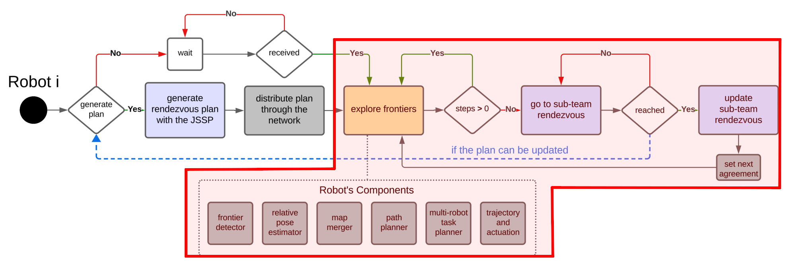
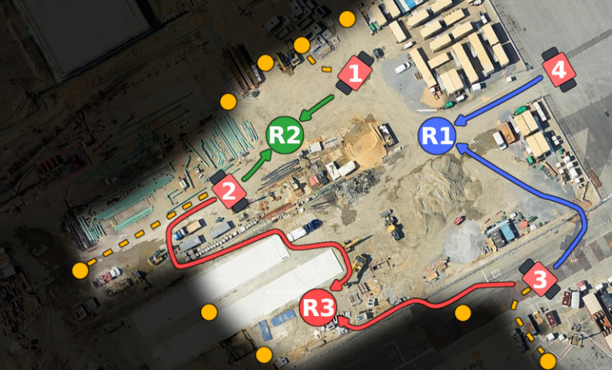
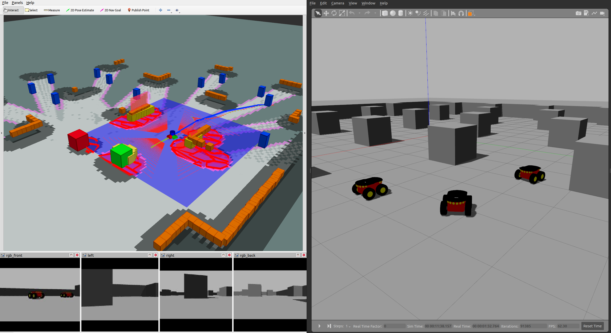
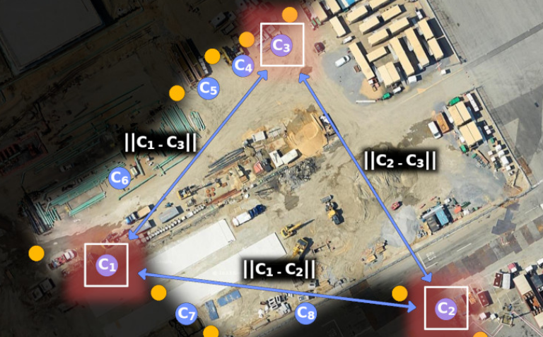

# [Table of Contents](#table-of-contents)

- [Setup](docs/working_environment.md)
- [Usage](docs/usage.md)
- [Robots](docs/robots.md)
- [Nodes](docs/multi-robot-exploration.md)
- [Contributing](docs/contributing.md)

## [ROS-Noetic-Multi-robot-Sandbox](#ros-noetic-multi-robot-sandbox)

This package has a fully opperational multi-robot exploration stack for ROS Noetic and Ubuntu 20.04 that allows them to keep intermittent communication in Gazebo 11 simulations from this [research](https://arxiv.org/abs/2309.13494). With some minor modifications it can be deployed into real robots for indoor exploration.

It is a deployment of the diagram's components highlighted in red that allows robots to explore and maintain intermittent connectivity through a rendezvous plan, where the communication is done through topics with a mock communication model.



## [What to Expect?](#what-to-expect)

### Fully opperational multi-robot exploration with communication constraints to accelerate your research and development.



### Complex stack integrated with customized nodes for ROS Noetic, with SLAM, map stitching, trajectory optimization, global and local planning, and more, to simulate a realistic multi-robot exploration application with communication constraints, visualization, and configurations for Gazebo 11 and Rviz.



### Intermittent Communication Policy to share information at rendezvous locations spread dynamically while exploration happens.



## [Disclaimer](#disclaimer)

This workspace is not based on the ```move_base``` and the ```nav``` stack for navigation, because they had many drawbacks when I first tried to used them for multi-robot exploration research. Therefore, this project contains its own ```sub-goal``` navigation node with ```global``` and ```local planners``` to handle situations posed by ```multi-robot exploration``` applications when robots do ```SLAM``` individually, have to deal with traffic, and share maps.

## [Packages and their Nodes](#packages)

- [Multi-robot Exploration](docs/multi-robot-exploration.md) - Contains the exploration stack for intermittent communication spread across several nodes.
  - **Policies**
    - [Yamauchi1999 node](docs/nodes/yamauchi1999.md)
    - [RandomizedSocialWelfare node](docs/nodes/randomized_social_welfare.md)
    - [Alysson2024 node](docs/nodes/alysson2024.md)
  - **Navigation**
    - [DesaiController node](docs/nodes/desai_controler.md)
    - [PotentialFieldLocalPlanner node](docs/nodes/potential_field_local_planner.md)
    - [MRELocalPlanner node](docs/nodes/mre_local_planner.md)
    - [SubGoalNav node](docs/nodes/sub_goal_navigation.md)
  - **Mapping**
    - [CSpace node](docs/nodes/cspace.md)
    - [FBMapFusionRelative node](docs/nodes/fb_map_fusion_relative.md)
    - [LocalDynamicMap node](docs/nodes/local_dynamic_map.md)
  - **Localization**
    - [AverageDisplacement node](docs/nodes/average_displacement.md)
    - [GmappingPose node](docs/nodes/gmapping_pose.md)
    - [RelativePoseEstimator node](docs/nodes/relative_pose_estimator.md)
  - **Lidar**
    - [LaserNoise node](docs/nodes/laser_noiser.md)
    - [LaserToWorld node](docs/nodes/laser_to_world.md)
  - **Frontiers**
    - [FrontierDiscovery node](docs/nodes/frontier_discovery.md)
  - **Communication**
    - [MockCommunicationModel node](docs/nodes/mock_communication_model.md)
    - [MockNetworkHandler node](docs/nodes/mock_network_handler.md)
  - **Objects and Algorithms**
    - [RendezvosPlan](docs/nodes/rendezvous_plan.md)
    - [RRTRoot](docs/nodes/rrt_root.md)
    - [SearchAlgorithms](docs/nodes/search_algorithms.md)
    - [Common](docs/nodes/common.md)
- [Multi-robot Simulations](docs/docs/multi-robot-simulations.md) - Contains the simulations and robots used by the algorithms.

## [Publications](#publications)

If this package is somehow useful to you, consider reading this [letter](docs/motivation.md) and mentioning this paper accepted on IROS.

> A. R. da Silva, L. Chaimowicz, T. C. Silva, and A. Hsieh, Communication-Constrained Multi-Robot Exploration with Intermittent Rendezvous. 2024.

```text
@misc{dasilva2024communicationconstrained,
      title={Communication-Constrained Multi-Robot Exploration with Intermittent Rendezvous}, 
      author={Alysson Ribeiro da Silva and Luiz Chaimowicz and Thales Costa Silva and Ani Hsieh},
      year={2024},
      eprint={2309.13494},
      archivePrefix={arXiv},
      primaryClass={cs.RO}
}
```

## [Partnerships](#partnerships)


## [License](#license)

All content from this repository is released under a modified [BSD 4-clause license](LICENSE).

Author/Maintainer:

- [Alysson Ribeiro da Silva](https://alysson.thegeneralsolution.com/)

Colaborators:

- [Ani Hsieh](https://mhsieh.seas.upenn.edu/)
- [Luiz Chaimowicz](https://dcc.ufmg.br/professor/luiz-chaimowicz/)
- [Thales Costa Silva](https://scalar.seas.upenn.edu/about-us/people/)

emails:

- <alysson.ribeiro.silva@gmail.com>

## [Bug & Feature Requests](#bug--feature-requests)

Please report bugs and do your requests to add new features through the [Issue Tracker](https://github.com/multirobotplayground/ROS-Noetic-Multi-robot-Sandbox/issues).
