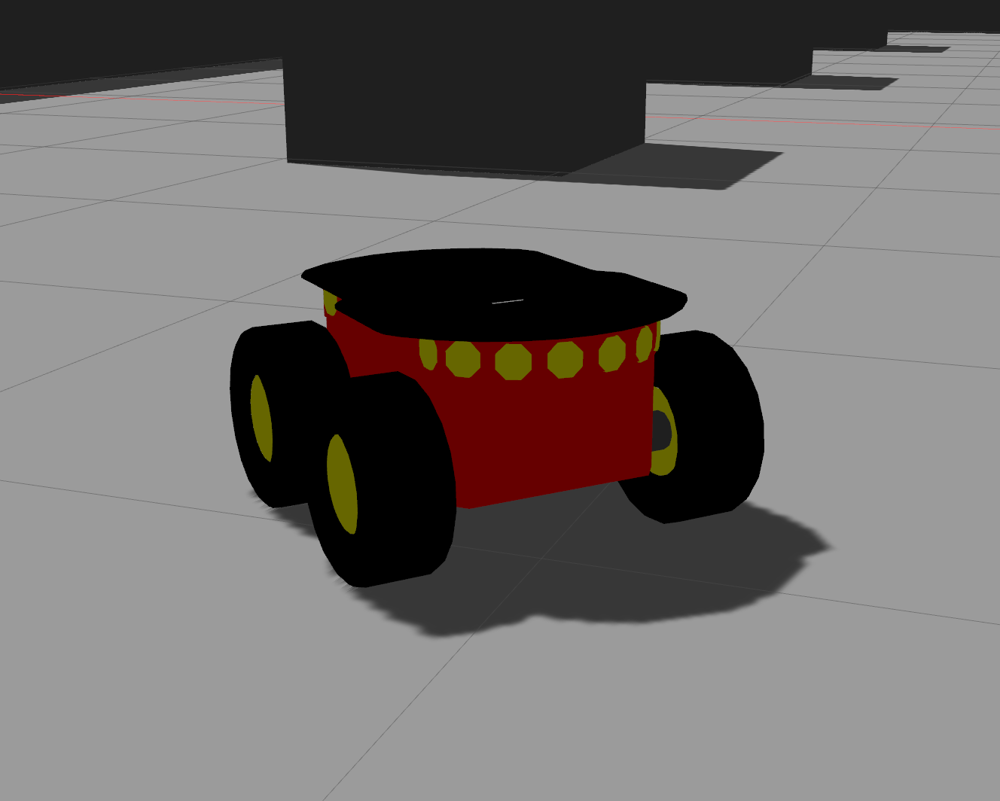
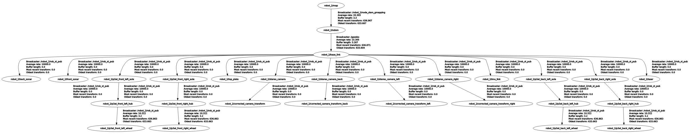
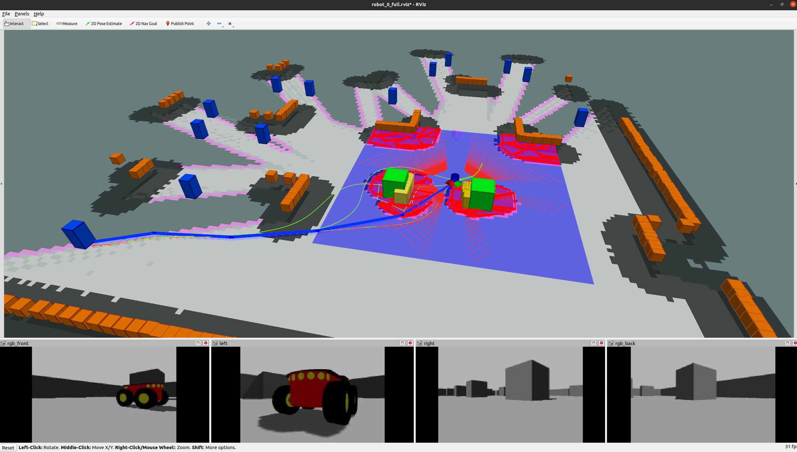

# Table of Contents

- [Table of Contents](#table-of-contents)
  - [Available Robots](#available-robots)
  - [Transform trees and sensors](#transform-trees-and-sensors)
  - [Pioneer3At](#pioneer3at)

## [Available Robots](#available-robots)

The robots were initially obtained from [here](https://wiki.ros.org/Robots/AMR_Pioneer_Compatible) and modified to attend the specifications needed for the research. The adaptation were necessary to add more robustness to the robots' behaviors when exploring the environment, such as avoiding other robots and yet building a clean map.

## [Transform trees and sensors](#transform-trees-and-sensors)

The transformation tree is a crucial part of the system, and improper configuration can disrupt your experiments. Unfortunately, ROS still has inconsistencies regarding how namespaces are handled by sensors and transforms.

To improve usability, I have configured all robots in this project with a transformation tree from a parameterized namespace assigned during launch. This setup makes them ready for experimentation in complex scenarios.

## [Pioneer3At](#clearpath-husky)

I've configured the Pioneer robot with:

- IMU
- 4 RGBD Cameras for dynamic obstacles
- 1 360 Lidar for static obstacles

I've configured the transformation tree as follows.

I've provided a basic RViz file to visualize this robot, its transforms, and model.

